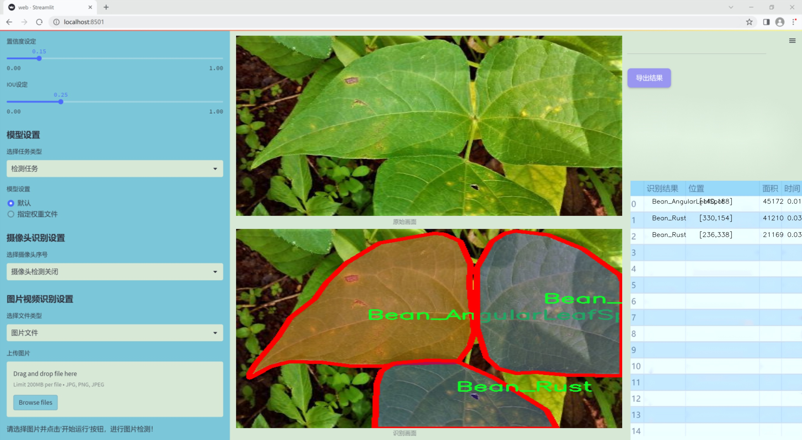
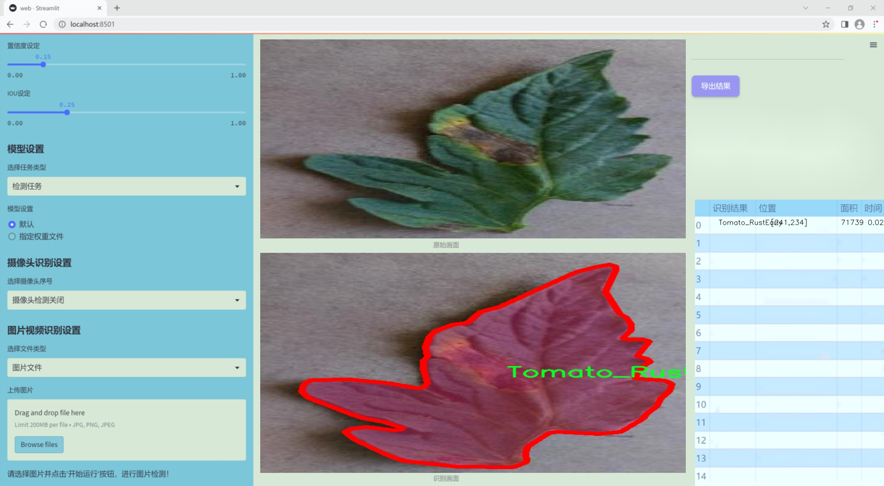
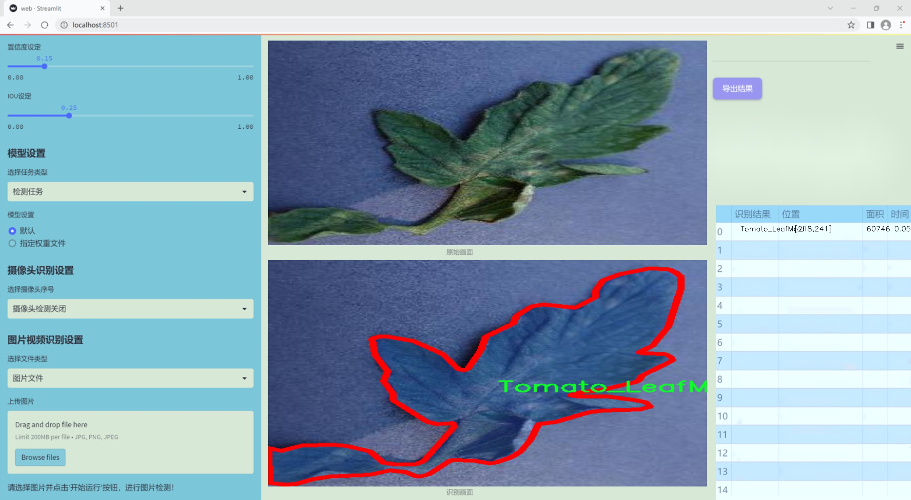
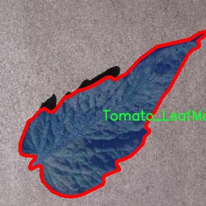
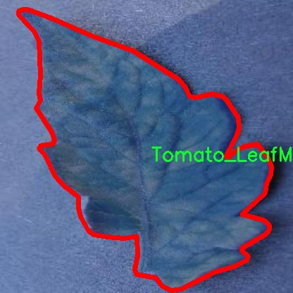
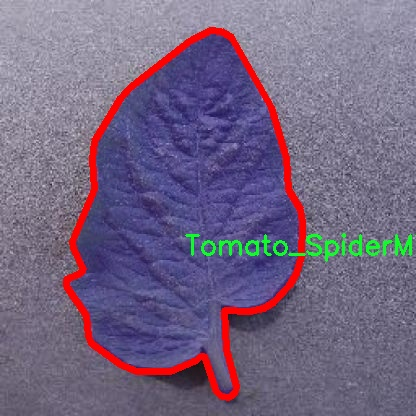

### 1.背景意义

### 研究背景与意义

随着全球农业生产的现代化进程加快，病害监测与管理在保障作物产量和质量方面变得愈发重要。西红柿作为一种重要的经济作物，其病害的及时检测与处理直接影响到农民的经济收益和食品安全。近年来，随着计算机视觉技术的迅猛发展，基于深度学习的图像处理方法逐渐成为农业病害检测的研究热点。尤其是YOLO（You Only Look Once）系列模型，以其高效的实时检测能力和较高的准确率，成为了病害识别领域的重要工具。

本研究旨在基于改进的YOLOv11模型，构建一个针对西红柿叶片病害的图像分割系统。该系统将利用一个包含4700张图像的多类别数据集，涵盖包括叶斑病、霜霉病、早期锈病等在内的12种病害类型。通过对这些图像的实例分割处理，系统能够精准地识别和定位病害区域，为农民提供科学的决策依据。数据集的多样性和丰富性使得模型在训练过程中能够更好地适应不同的病害特征，从而提高检测的准确性和鲁棒性。

此外，病害检测的自动化和智能化不仅能够减少人工巡查的时间和成本，还能在早期阶段及时发现病害，降低病害蔓延的风险。这对于提升农业生产效率、减少农药使用、保护生态环境具有重要的现实意义。因此，基于改进YOLOv11的西红柿叶片病害检测图像分割系统的研究，不仅推动了计算机视觉技术在农业领域的应用，也为实现精准农业提供了新的思路和方法。通过该系统的实施，能够有效提升西红柿病害管理的智能化水平，为农业可持续发展贡献力量。

### 2.视频效果

[2.1 视频效果](https://www.bilibili.com/video/BV18oroYxEqb/)

### 3.图片效果







##### [项目涉及的源码数据来源链接](https://kdocs.cn/l/cszuIiCKVNis)**

注意：本项目提供训练的数据集和训练教程,由于版本持续更新,暂不提供权重文件（best.pt）,请按照6.训练教程进行训练后实现上图演示的效果。

### 4.数据集信息

##### 4.1 本项目数据集类别数＆类别名

nc: 12
names: ['Bean_AngularLeafSpot', 'Bean_Healthy', 'Bean_Rust', 'Strawberry_AngularLeafSpot', 'Strawberry_AnthracnoseFruitRot', 'Strawberry_BlossomBlight', 'Strawberry_GrayMold', 'Strawberry_PowderyMildewFruit', 'Strawberry_PowderyMildewLeaf', 'Tomato_LeafMold', 'Tomato_RustEarly', 'Tomato_SpiderMites']


该项目为【图像分割】数据集，请在【训练教程和Web端加载模型教程（第三步）】这一步的时候按照【图像分割】部分的教程来训练

##### 4.2 本项目数据集信息介绍

本项目数据集信息介绍。本项目旨在改进YOLOv11的西红柿叶片病害检测图像分割系统，因此所使用的数据集专注于作物监测，尤其是与豆类和草莓、番茄等作物相关的病害。该数据集包含12个类别，涵盖了多种作物的健康状态及其常见病害，具体类别包括：豆类的角叶斑病、健康状态及锈病；草莓的角叶斑病、果腐病、花朵枯萎病、灰霉病、以及叶片的白粉病；番茄的叶霉病、早期锈病和蜘蛛螨。这些类别的选择不仅反映了当前农业生产中面临的主要病害问题，也为作物健康监测提供了多样化的样本。

数据集中的图像均经过精心挑选和标注，确保其在不同生长阶段和不同环境条件下的代表性。这些图像将用于训练深度学习模型，以提高病害检测的准确性和效率。通过使用这些多样化的样本，模型能够学习到不同病害的特征，从而在实际应用中更好地识别和分类作物病害，帮助农民及时采取防治措施，减少损失。

此外，数据集的设计考虑到了实际农业生产中的复杂性，包含了多种光照、角度和背景条件下的图像，以增强模型的鲁棒性和适应性。通过这样的数据集构建，我们期望能够推动作物监测技术的发展，为农业智能化提供有力支持。









### 5.全套项目环境部署视频教程（零基础手把手教学）

[5.1 所需软件PyCharm和Anaconda安装教程（第一步）](https://www.bilibili.com/video/BV1BoC1YCEKi/?spm_id_from=333.999.0.0&vd_source=bc9aec86d164b67a7004b996143742dc)


[5.2 安装Python虚拟环境创建和依赖库安装视频教程（第二步）](https://www.bilibili.com/video/BV1ZoC1YCEBw?spm_id_from=333.788.videopod.sections&vd_source=bc9aec86d164b67a7004b996143742dc)

### 6.改进YOLOv11训练教程和Web_UI前端加载模型教程（零基础手把手教学）

[6.1 改进YOLOv11训练教程和Web_UI前端加载模型教程（第三步）](https://www.bilibili.com/video/BV1BoC1YCEhR?spm_id_from=333.788.videopod.sections&vd_source=bc9aec86d164b67a7004b996143742dc)


按照上面的训练视频教程链接加载项目提供的数据集，运行train.py即可开始训练



     Epoch   gpu_mem       box       obj       cls    labels  img_size
     1/200     20.8G   0.01576   0.01955  0.007536        22      1280: 100%|██████████| 849/849 [14:42<00:00,  1.04s/it]
               Class     Images     Labels          P          R     mAP@.5 mAP@.5:.95: 100%|██████████| 213/213 [01:14<00:00,  2.87it/s]
                 all       3395      17314      0.994      0.957      0.0957      0.0843

     Epoch   gpu_mem       box       obj       cls    labels  img_size
     2/200     20.8G   0.01578   0.01923  0.007006        22      1280: 100%|██████████| 849/849 [14:44<00:00,  1.04s/it]
               Class     Images     Labels          P          R     mAP@.5 mAP@.5:.95: 100%|██████████| 213/213 [01:12<00:00,  2.95it/s]
                 all       3395      17314      0.996      0.956      0.0957      0.0845

     Epoch   gpu_mem       box       obj       cls    labels  img_size
     3/200     20.8G   0.01561    0.0191  0.006895        27      1280: 100%|██████████| 849/849 [10:56<00:00,  1.29it/s]
               Class     Images     Labels          P          R     mAP@.5 mAP@.5:.95: 100%|███████   | 187/213 [00:52<00:00,  4.04it/s]
                 all       3395      17314      0.996      0.957      0.0957      0.0845


###### [项目数据集下载链接](https://kdocs.cn/l/cszuIiCKVNis)

### 7.原始YOLOv11算法讲解

YOLOv11是一种由Ultralytics公司开发的最新一代目标检测模型，以其增强的特征提取能力和更高的效率在计算机视觉领域引人注目。该模型在架构上进行了关键升级，通过更新主干和颈部结构，显著提高了对复杂视觉场景的理解和处理精度。YOLOv11不仅在目标检测上表现出色，还支持实例分割、图像分类、姿态估计和定向目标检测（OBB）等任务，展示出其多功能性。

与其前身YOLOv8相比，YOLOv11在设计上实现了深度和宽度的改变，同时引入了几个创新机制。其中，C3k2机制是对YOLOv8中的C2f的改进，提升了浅层特征的处理能力；C2PSA机制则进一步优化了特征图的处理流程。解耦头的创新设计，通过增加两个深度卷积（DWConv），提高了模型对细节的感知能力和分类准确性。

在性能上，YOLOv11m模型在COCO数据集上的平均精度（mAP）提高，并减少了22%的参数量，确保了在运算效率上的突破。该模型可以部署在多种平台上，包括边缘设备、云平台以及支持NVIDIA GPU的系统，彰显出卓越的灵活性和适应性。总体而言，YOLOv11通过一系列的创新突破，对目标检测领域产生了深远的影响，并为未来的开发提供了新的研究方向。


****文档**** ： _ _https://docs.ultralytics.com/models/yolo11/__

****代码链接**** ： _ _https://github.com/ultralytics/ultralytics__

******Performance Metrics******


​ ** **关键特性****

****◆**** ** **增强的特征提取能力**** ：YOLO11采用了改进的主干和颈部架构，增强了 ** **特征提取****
能力，能够实现更精确的目标检测和复杂任务的执行。

****◆**** ** **优化的效率和速度****
：YOLO11引入了精细化的架构设计和优化的训练流程，提供更快的处理速度，并在准确性和性能之间保持最佳平衡。

****◆**** ** **参数更少、精度更高****
：通过模型设计的改进，YOLO11m在COCO数据集上实现了更高的平均精度（mAP），同时使用的参数比YOLOv8m少22%，使其在计算上更加高效，而不牺牲准确性。

****◆**** ** **跨环境的适应性**** ：YOLO11可以无缝部署在各种环境中，包括边缘设备、云平台和支持NVIDIA
GPU的系统，确保最大的灵活性。

****◆**** ** **支持广泛任务****
：无论是目标检测、实例分割、图像分类、姿态估计还是定向目标检测（OBB），YOLO11都旨在应对一系列计算机视觉挑战。

****支持的任务和模式****


​YOLO11建立在YOLOv8中引入的多功能模型范围之上，为各种计算机视觉任务提供增强的支持:


​该表提供了YOLO11模型变体的概述，展示了它们在特定任务中的适用性以及与Inference、Validation、Training和Export等操作模式的兼容性。从实时检测到复杂的分割任务
，这种灵活性使YOLO11适用于计算机视觉的广泛应用。

##### yolov11的创新

■ yolov8 VS yolov11

YOLOv5，YOLOv8和YOLOv11均是ultralytics公司的作品，ultralytics出品必属精品。


​ **具体创新点** ：

**① 深度（depth）和宽度 （width）**

YOLOv8和YOLOv11是基本上完全不同。

**② C3k2机制**

C3k2有参数为c3k，其中在网络的浅层c3k设置为False。C3k2就相当于YOLOv8中的C2f。


​ **③ C2PSA机制**

下图为C2PSA机制的原理图。


​ **④ 解耦头**

解耦头中的分类检测头增加了两个 **DWConv** 。


▲Conv

    
    
    def autopad(k, p=None, d=1):  # kernel, padding, dilation
    
        """Pad to 'same' shape outputs."""
    
        if d > 1:
    
            k = d * (k - 1) + 1 if isinstance(k, int) else [d * (x - 1) + 1 for x in k]  # actual kernel-size
    
        if p is None:
    
            p = k // 2 if isinstance(k, int) else [x // 2 for x in k]  # auto-pad
    
    return p
    
    
    class Conv(nn.Module):
    
        """Standard convolution with args(ch_in, ch_out, kernel, stride, padding, groups, dilation, activation)."""
    
    
        default_act = nn.SiLU()  # default activation
    
    
        def __init__(self, c1, c2, k=1, s=1, p=None, g=1, d=1, act=True):
    
            """Initialize Conv layer with given arguments including activation."""
    
            super().__init__()
    
            self.conv = nn.Conv2d(c1, c2, k, s, autopad(k, p, d), groups=g, dilation=d, bias=False)
    
            self.bn = nn.BatchNorm2d(c2)
    
            self.act = self.default_act if act is True else act if isinstance(act, nn.Module) else nn.Identity()
    
    
        def forward(self, x):
    
            """Apply convolution, batch normalization and activation to input tensor."""
    
            return self.act(self.bn(self.conv(x)))
    
    
        def forward_fuse(self, x):
    
            """Perform transposed convolution of 2D data."""
    
            return self.act(self.conv(x))

▲Conv2d

    
    
    torch.nn.Conv2d(in_channels, out_channels, kernel_size, stride=1, padding=0, dilation=1, groups=1, bias=True, padding_mode='zeros')

▲DWConv

DWConv ** **代表 Depthwise Convolution（深度卷积）****
，是一种在卷积神经网络中常用的高效卷积操作。它主要用于减少计算复杂度和参数量。

    
    
    class DWConv(Conv):
    
        """Depth-wise convolution."""
    
    
        def __init__(self, c1, c2, k=1, s=1, d=1, act=True):  # ch_in, ch_out, kernel, stride, dilation, activation
    
            """Initialize Depth-wise convolution with given parameters."""
    
            super().__init__(c1, c2, k, s, g=math.gcd(c1, c2), d=d, act=act)


### 8.200+种全套改进YOLOV11创新点原理讲解

#### 8.1 200+种全套改进YOLOV11创新点原理讲解大全

由于篇幅限制，每个创新点的具体原理讲解就不全部展开，具体见下列网址中的改进模块对应项目的技术原理博客网址【Blog】（创新点均为模块化搭建，原理适配YOLOv5~YOLOv11等各种版本）

[改进模块技术原理博客【Blog】网址链接](https://gitee.com/qunmasj/good)


#### 8.2 精选部分改进YOLOV11创新点原理讲解

###### 这里节选部分改进创新点展开原理讲解(完整的改进原理见上图和[改进模块技术原理博客链接](https://gitee.com/qunmasj/good)【如果此小节的图加载失败可以通过CSDN或者Github搜索该博客的标题访问原始博客，原始博客图片显示正常】


### YOLO-MS简介
实时目标检测，以YOLO系列为例，已在工业领域中找到重要应用，特别是在边缘设备（如无人机和机器人）中。与之前的目标检测器不同，实时目标检测器旨在在速度和准确性之间追求最佳平衡。为了实现这一目标，提出了大量的工作：从第一代DarkNet到CSPNet，再到最近的扩展ELAN，随着性能的快速增长，实时目标检测器的架构经历了巨大的变化。

尽管性能令人印象深刻，但在不同尺度上识别对象仍然是实时目标检测器面临的基本挑战。这促使作者设计了一个强大的编码器架构，用于学习具有表现力的多尺度特征表示。具体而言，作者从两个新的角度考虑为实时目标检测编码多尺度特征：

从局部视角出发，作者设计了一个具有简单而有效的分层特征融合策略的MS-Block。受到Res2Net的启发，作者在MS-Block中引入了多个分支来进行特征提取，但不同的是，作者使用了一个带有深度卷积的 Inverted Bottleneck Block块，以实现对大Kernel的高效利用。

从全局视角出发，作者提出随着网络加深逐渐增加卷积的Kernel-Size。作者在浅层使用小Kernel卷积来更高效地处理高分辨率特征。另一方面，在深层中，作者采用大Kernel卷积来捕捉广泛的信息。

基于以上设计原则，作者呈现了作者的实时目标检测器，称为YOLO-MS。为了评估作者的YOLO-MS的性能，作者在MS COCO数据集上进行了全面的实验。还提供了与其他最先进方法的定量比较，以展示作者方法的强大性能。如图1所示，YOLO-MS在计算性能平衡方面优于其他近期的实时目标检测器。


具体而言，YOLO-MS-XS在MS COCO上获得了43%+的AP得分，仅具有450万个可学习参数和8.7亿个FLOPs。YOLO-MS-S和YOLO-MS分别获得了46%+和51%+的AP，可学习参数分别为810万和2220万。此外，作者的工作还可以作为其他YOLO模型的即插即用模块。通常情况下，作者的方法可以将YOLOv11的AP从37%+显著提高到40%+，甚至还可以使用更少的参数和FLOPs。


#### Multi-Scale Building Block Design
CSP Block是一个基于阶段级梯度路径的网络，平衡了梯度组合和计算成本。它是广泛应用于YOLO系列的基本构建块。已经提出了几种变体，包括YOLOv4和YOLOv11中的原始版本，Scaled YOLOv4中的CSPVoVNet，YOLOv11中的ELAN，以及RTMDet中提出的大Kernel单元。作者在图2(a)和图2(b)中分别展示了原始CSP块和ELAN的结构。


上述实时检测器中被忽视的一个关键方面是如何在基本构建块中编码多尺度特征。其中一个强大的设计原则是Res2Net，它聚合了来自不同层次的特征以增强多尺度表示。然而，这一原则并没有充分探索大Kernel卷积的作用，而大Kernel卷积已经在基于CNN的视觉识别任务模型中证明有效。将大Kernel卷积纳入Res2Net的主要障碍在于它们引入的计算开销，因为构建块采用了标准卷积。在作者的方法中，作者提出用 Inverted Bottleneck Block替代标准的3 × 3卷积，以享受大Kernel卷积的好处。

基于前面的分析，作者提出了一个带有分层特征融合策略的全新Block，称为MS-Block，以增强实时目标检测器在提取多尺度特征时的能力，同时保持快速的推理速度。

MS-Block的具体结构如图2(c)所示。假设是输入特征。通过1×1卷积的转换后，X的通道维度增加到n*C。然后，作者将X分割成n个不同的组，表示为，其中。为了降低计算成本，作者选择n为3。

注意，除了之外，每个其他组都经过一个 Inverted Bottleneck Block层，用表示，其中k表示Kernel-Size，以获得。的数学表示如下：


根据这个公式，该博客的作者不将 Inverted Bottleneck Block层连接，使其作为跨阶段连接，并保留来自前面层的信息。最后，作者将所有分割连接在一起，并应用1×1卷积来在所有分割之间进行交互，每个分割都编码不同尺度的特征。当网络加深时，这个1×1卷积也用于调整通道数。

#### Heterogeneous Kernel Selection Protocol
除了构建块的设计外，作者还从宏观角度探讨了卷积的使用。之前的实时目标检测器在不同的编码器阶段采用了同质卷积（即具有相同Kernel-Size的卷积），但作者认为这不是提取多尺度语义信息的最佳选项。

在金字塔结构中，从检测器的浅阶段提取的高分辨率特征通常用于捕捉细粒度语义，将用于检测小目标。相反，来自网络较深阶段的低分辨率特征用于捕捉高级语义，将用于检测大目标。如果作者在所有阶段都采用统一的小Kernel卷积，深阶段的有效感受野（ERF）将受到限制，影响大目标的性能。在每个阶段中引入大Kernel卷积可以帮助解决这个问题。然而，具有大的ERF的大Kernel可以编码更广泛的区域，这增加了在小目标外部包含噪声信息的概率，并且降低了推理速度。

在这项工作中，作者建议在不同阶段中采用异构卷积，以帮助捕获更丰富的多尺度特征。具体来说，在编码器的第一个阶段中，作者采用最小Kernel卷积，而最大Kernel卷积位于最后一个阶段。随后，作者逐步增加中间阶段的Kernel-Size，使其与特征分辨率的增加保持一致。这种策略允许提取细粒度和粗粒度的语义信息，增强了编码器的多尺度特征表示能力。

正如图所示，作者将k的值分别分配给编码器中的浅阶段到深阶段，取值为3、5、7和9。作者将其称为异构Kernel选择（HKS）协议。


作者的HKS协议能够在深层中扩大感受野，而不会对浅层产生任何其他影响。此外，HKS不仅有助于编码更丰富的多尺度特征，还确保了高效的推理。

如表1所示，将大Kernel卷积应用于高分辨率特征会产生较高的计算开销。然而，作者的HKS协议在低分辨率特征上采用大Kernel卷积，从而与仅使用大Kernel卷积相比，大大降低了计算成本。


在实践中，作者经验性地发现，采用HKS协议的YOLO-MS的推理速度几乎与仅使用深度可分离的3 × 3卷积相同。

#### Architecture
如图所示，作者模型的Backbone由4个阶段组成，每个阶段后面跟随1个步长为2的3 × 3卷积进行下采样。在第3个阶段后，作者添加了1个SPP块，与RTMDet中一样。在作者的编码器上，作者使用PAFPN作为Neck来构建特征金字塔[31, 35]。它融合了从Backbone不同阶段提取的多尺度特征。Neck中使用的基本构建块也是作者的MS-Block，在其中使用3 × 3深度可分离卷积进行快速推理。

此外，为了在速度和准确性之间取得更好的平衡，作者将Backbone中多级特征的通道深度减半。作者提供了3个不同尺度的YOLO-MS变体，即YOLO-MS-XS、YOLO-MS-S和YOLO-MS。不同尺度的YOLO-MS的详细配置列在表2中。对于YOLO-MS的其他部分，作者将其保持与RTMDet相同。


### 9.系统功能展示

图9.1.系统支持检测结果表格显示

  图9.2.系统支持置信度和IOU阈值手动调节

  图9.3.系统支持自定义加载权重文件best.pt(需要你通过步骤5中训练获得)

  图9.4.系统支持摄像头实时识别

  图9.5.系统支持图片识别

  图9.6.系统支持视频识别

  图9.7.系统支持识别结果文件自动保存

  图9.8.系统支持Excel导出检测结果数据


### 10. YOLOv11核心改进源码讲解

#### 10.1 orepa.py

下面是对给定代码的核心部分进行分析和注释的结果。我们将保留主要的类和方法，并添加详细的中文注释，以帮助理解代码的功能和实现。

```python
import torch
import torch.nn as nn
import torch.nn.init as init
import torch.nn.functional as F
import numpy as np
from ..modules.conv import autopad, Conv
from .attention import SEAttention

# 定义模块的导出
__all__ = ['OREPA', 'OREPA_LargeConv', 'RepVGGBlock_OREPA']

# 将卷积核和批归一化的参数融合
def transI_fusebn(kernel, bn):
    gamma = bn.weight  # 获取BN层的缩放因子
    std = (bn.running_var + bn.eps).sqrt()  # 计算标准差
    return kernel * ((gamma / std).reshape(-1, 1, 1, 1)), bn.bias - bn.running_mean * gamma / std

# 多尺度填充
def transVI_multiscale(kernel, target_kernel_size):
    H_pixels_to_pad = (target_kernel_size - kernel.size(2)) // 2
    W_pixels_to_pad = (target_kernel_size - kernel.size(3)) // 2
    return F.pad(kernel, [W_pixels_to_pad, W_pixels_to_pad, H_pixels_to_pad, H_pixels_to_pad])

# OREPA模块定义
class OREPA(nn.Module):
    def __init__(self, in_channels, out_channels, kernel_size=3, stride=1, padding=None, groups=1, dilation=1, act=True, deploy=False):
        super(OREPA, self).__init__()
        self.deploy = deploy  # 是否为部署模式

        # 激活函数的选择
        self.nonlinear = Conv.default_act if act is True else act if isinstance(act, nn.Module) else nn.Identity()
        
        # 初始化卷积参数
        self.kernel_size = kernel_size
        self.in_channels = in_channels
        self.out_channels = out_channels
        self.groups = groups
        self.stride = stride
        padding = autopad(kernel_size, padding, dilation)  # 自动计算填充
        self.padding = padding
        self.dilation = dilation

        # 部署模式下直接使用卷积层
        if deploy:
            self.orepa_reparam = nn.Conv2d(in_channels=in_channels, out_channels=out_channels, kernel_size=kernel_size, stride=stride,
                                            padding=padding, dilation=dilation, groups=groups, bias=True)
        else:
            # 初始化权重参数
            self.weight_orepa_origin = nn.Parameter(torch.Tensor(out_channels, int(in_channels / self.groups), kernel_size, kernel_size))
            init.kaiming_uniform_(self.weight_orepa_origin, a=math.sqrt(0.0))

            # 其他权重参数
            self.weight_orepa_avg_conv = nn.Parameter(torch.Tensor(out_channels, int(in_channels / self.groups), 1, 1))
            init.kaiming_uniform_(self.weight_orepa_avg_conv, a=0.0)

            self.weight_orepa_pfir_conv = nn.Parameter(torch.Tensor(out_channels, int(in_channels / self.groups), 1, 1))
            init.kaiming_uniform_(self.weight_orepa_pfir_conv, a=0.0)

            # 平均卷积权重
            self.register_buffer('weight_orepa_avg_avg', torch.ones(kernel_size, kernel_size).mul(1.0 / kernel_size / kernel_size))

            # 1x1卷积权重
            self.weight_orepa_1x1 = nn.Parameter(torch.Tensor(out_channels, int(in_channels / self.groups), 1, 1))
            init.kaiming_uniform_(self.weight_orepa_1x1, a=0.0)

            # 其他参数初始化
            self.fre_init()

    def fre_init(self):
        # 初始化先验权重
        prior_tensor = torch.Tensor(self.out_channels, self.kernel_size, self.kernel_size)
        half_fg = self.out_channels / 2
        for i in range(self.out_channels):
            for h in range(3):
                for w in range(3):
                    if i < half_fg:
                        prior_tensor[i, h, w] = math.cos(math.pi * (h + 0.5) * (i + 1) / 3)
                    else:
                        prior_tensor[i, h, w] = math.cos(math.pi * (w + 0.5) * (i + 1 - half_fg) / 3)

        self.register_buffer('weight_orepa_prior', prior_tensor)

    def weight_gen(self):
        # 生成权重
        weight_orepa_origin = torch.einsum('oihw,o->oihw', self.weight_orepa_origin, self.vector[0, :])
        # 其他权重生成过程...
        return weight

    def forward(self, inputs=None):
        # 前向传播
        if hasattr(self, 'orepa_reparam'):
            return self.nonlinear(self.orepa_reparam(inputs))
        
        weight = self.weight_gen()  # 生成权重

        out = F.conv2d(inputs, weight, bias=None, stride=self.stride, padding=self.padding, dilation=self.dilation, groups=self.groups)
        return self.nonlinear(out)

# OREPA_LargeConv模块定义
class OREPA_LargeConv(nn.Module):
    def __init__(self, in_channels, out_channels, kernel_size=1, stride=1, padding=None, groups=1, dilation=1, act=True, deploy=False):
        super(OREPA_LargeConv, self).__init__()
        assert kernel_size % 2 == 1 and kernel_size > 3  # 确保卷积核大小为奇数且大于3
        
        padding = autopad(kernel_size, padding, dilation)
        self.stride = stride
        self.padding = padding
        self.layers = int((kernel_size - 1) / 2)  # 计算层数
        self.groups = groups
        self.dilation = dilation

        self.kernel_size = kernel_size
        self.in_channels = in_channels
        self.out_channels = out_channels

        if deploy:
            self.or_large_reparam = nn.Conv2d(in_channels=in_channels, out_channels=out_channels, kernel_size=kernel_size, stride=stride,
                                               padding=padding, dilation=dilation, groups=groups, bias=True)
        else:
            # 初始化多个OREPA层
            for i in range(self.layers):
                if i == 0:
                    self.__setattr__('weight' + str(i), OREPA(in_channels, out_channels, kernel_size=3, stride=1, padding=1, groups=groups, weight_only=True))
                elif i == self.layers - 1:
                    self.__setattr__('weight' + str(i), OREPA(out_channels, out_channels, kernel_size=3, stride=self.stride, padding=1, weight_only=True))
                else:
                    self.__setattr__('weight' + str(i), OREPA(out_channels, out_channels, kernel_size=3, stride=1, padding=1, weight_only=True))

            self.bn = nn.BatchNorm2d(out_channels)

    def weight_gen(self):
        # 生成权重
        weight = getattr(self, 'weight' + str(0)).weight_gen().transpose(0, 1)
        for i in range(self.layers - 1):
            weight2 = getattr(self, 'weight' + str(i + 1)).weight_gen()
            weight = F.conv2d(weight, weight2, groups=self.groups, padding=2)
        
        return weight.transpose(0, 1)

    def forward(self, inputs):
        # 前向传播
        if hasattr(self, 'or_large_reparam'):
            return self.nonlinear(self.or_large_reparam(inputs))

        weight = self.weight_gen()
        out = F.conv2d(inputs, weight, stride=self.stride, padding=self.padding, dilation=self.dilation, groups=self.groups)
        return self.nonlinear(out)

# RepVGGBlock_OREPA模块定义
class RepVGGBlock_OREPA(nn.Module):
    def __init__(self, in_channels, out_channels, kernel_size, stride=1, padding=None, groups=1, dilation=1, act=True, deploy=False, use_se=False):
        super(RepVGGBlock_OREPA, self).__init__()
        self.deploy = deploy
        self.groups = groups
        self.in_channels = in_channels
        self.out_channels = out_channels

        padding = autopad(kernel_size, padding, dilation)
        self.padding = padding
        self.dilation = dilation

        self.nonlinearity = Conv.default_act if act is True else act if isinstance(act, nn.Module) else nn.Identity()

        if use_se:
            self.se = SEAttention(out_channels, reduction=out_channels // 16)  # 使用SE注意力机制
        else:
            self.se = nn.Identity()

        if deploy:
            self.rbr_reparam = nn.Conv2d(in_channels=in_channels, out_channels=out_channels, kernel_size=kernel_size, stride=stride,
                                          padding=padding, dilation=dilation, groups=groups, bias=True)
        else:
            self.rbr_dense = OREPA_3x3_RepVGG(in_channels=in_channels, out_channels=out_channels, kernel_size=kernel_size, stride=stride, padding=padding, groups=groups)
            self.rbr_1x1 = ConvBN(in_channels=in_channels, out_channels=out_channels, kernel_size=1, stride=stride, groups=groups)

    def forward(self, inputs):
        # 前向传播
        if hasattr(self, 'rbr_reparam'):
            return self.nonlinearity(self.se(self.rbr_reparam(inputs)))

        out1 = self.rbr_dense(inputs)  # 通过OREPA层
        out2 = self.rbr_1x1(inputs)  # 通过1x1卷积
        out = out1 + out2  # 残差连接
        return self.nonlinearity(self.se(out))  # 激活并返回结果
```

### 代码分析
1. **模块结构**：代码定义了多个模块，主要包括 `OREPA`, `OREPA_LargeConv`, 和 `RepVGGBlock_OREPA`。这些模块实现了不同的卷积操作，使用了参数重参数化和批归一化等技术。

2. **权重生成**：每个模块中都有 `weight_gen` 方法，用于生成卷积层的权重。这些权重是通过多个参数的线性组合生成的，支持多种卷积结构。

3. **前向传播**：每个模块都有 `forward` 方法，负责处理输入数据并返回输出。根据是否在部署模式下，选择不同的处理方式。

4. **参数初始化**：使用了 Kaiming 初始化方法来初始化卷积层的权重，确保网络在训练初期的稳定性。

5. **SE注意力机制**：在 `RepVGGBlock_OREPA` 中，可以选择是否使用 SE 注意力机制来增强特征表示能力。

6. **融合批归一化**：提供了将卷积层和批归一化层融合的功能，以便在推理时减少计算量。

### 总结
以上代码实现了一个复杂的卷积神经网络模块，利用了多种现代深度学习技术，如参数重参数化、批归一化、SE注意力机制等，旨在提高模型的表现和效率。通过详细的注释，帮助理解每个部分的功能和实现方式。

这个文件定义了一个名为 `orepa.py` 的深度学习模块，主要用于构建一种名为 OREPA（即“重参数化卷积”）的卷积神经网络结构。该模块使用 PyTorch 框架，包含多个类和函数，旨在实现高效的卷积操作和参数重参数化。

首先，文件中导入了必要的库，包括 PyTorch 的核心库、神经网络模块、数学库和 NumPy。接着，定义了一些辅助函数，例如 `transI_fusebn` 和 `transVI_multiscale`，这些函数用于处理卷积核和批归一化层的融合以及多尺度的卷积核填充。

`OREPA` 类是这个模块的核心部分，继承自 `nn.Module`。在其构造函数中，定义了输入和输出通道、卷积核大小、步幅、填充、分组卷积等参数。根据是否处于部署模式，类的行为会有所不同。在训练模式下，类会初始化多个卷积核参数，并使用 Kaiming 初始化方法来初始化权重。在部署模式下，类会创建一个标准的卷积层。

`OREPA` 类的 `forward` 方法实现了前向传播，首先生成卷积权重，然后执行卷积操作，最后应用非线性激活函数和批归一化。类中还包含了多个辅助方法，例如 `weight_gen` 用于生成最终的卷积权重，`get_equivalent_kernel_bias` 用于获取融合后的卷积核和偏置，`switch_to_deploy` 用于切换到部署模式。

`OREPA_LargeConv` 类是一个扩展类，专门用于处理较大的卷积核。它的构造函数与 `OREPA` 类类似，但会根据卷积核的大小和层数构建多个 OREPA 模块，并在前向传播中生成相应的权重。

`ConvBN` 类则是一个简单的卷积加批归一化的组合，支持在部署模式下直接使用卷积层。

`OREPA_3x3_RepVGG` 类实现了一个特定的卷积块，结合了 OREPA 和 RepVGG 的特性，支持多种卷积操作并在前向传播中进行加法融合。

最后，`RepVGGBlock_OREPA` 类实现了一个完整的卷积块，支持多种卷积操作（如密集卷积、1x1 卷积和恒等映射），并结合了 SE 注意力机制（如果启用）。它的前向传播方法会将不同的输出进行加和，并应用非线性激活函数。

整体来看，这个模块通过重参数化技术和多种卷积操作的组合，旨在提高模型的灵活性和效率，适用于各种计算机视觉任务。

#### 10.2 wtconv2d.py

以下是代码中最核心的部分，并附上详细的中文注释：

```python
import torch
import torch.nn as nn
import torch.nn.functional as F
from torch.autograd import Function
import pywt

# 创建小波滤波器
def create_wavelet_filter(wave, in_size, out_size, type=torch.float):
    # 使用pywt库创建小波对象
    w = pywt.Wavelet(wave)
    # 反转小波的分解高通和低通滤波器
    dec_hi = torch.tensor(w.dec_hi[::-1], dtype=type)
    dec_lo = torch.tensor(w.dec_lo[::-1], dtype=type)
    # 生成分解滤波器
    dec_filters = torch.stack([dec_lo.unsqueeze(0) * dec_lo.unsqueeze(1),
                               dec_lo.unsqueeze(0) * dec_hi.unsqueeze(1),
                               dec_hi.unsqueeze(0) * dec_lo.unsqueeze(1),
                               dec_hi.unsqueeze(0) * dec_hi.unsqueeze(1)], dim=0)
    # 扩展滤波器以适应输入通道数
    dec_filters = dec_filters[:, None].repeat(in_size, 1, 1, 1)

    # 反转小波的重构高通和低通滤波器
    rec_hi = torch.tensor(w.rec_hi[::-1], dtype=type).flip(dims=[0])
    rec_lo = torch.tensor(w.rec_lo[::-1], dtype=type).flip(dims=[0])
    # 生成重构滤波器
    rec_filters = torch.stack([rec_lo.unsqueeze(0) * rec_lo.unsqueeze(1),
                               rec_lo.unsqueeze(0) * rec_hi.unsqueeze(1),
                               rec_hi.unsqueeze(0) * rec_lo.unsqueeze(1),
                               rec_hi.unsqueeze(0) * rec_hi.unsqueeze(1)], dim=0)
    # 扩展滤波器以适应输出通道数
    rec_filters = rec_filters[:, None].repeat(out_size, 1, 1, 1)

    return dec_filters, rec_filters

# 小波变换
def wavelet_transform(x, filters):
    b, c, h, w = x.shape  # 获取输入的批次大小、通道数、高度和宽度
    pad = (filters.shape[2] // 2 - 1, filters.shape[3] // 2 - 1)  # 计算填充
    # 进行2D卷积，应用小波滤波器
    x = F.conv2d(x, filters.to(x.dtype).to(x.device), stride=2, groups=c, padding=pad)
    x = x.reshape(b, c, 4, h // 2, w // 2)  # 重塑输出
    return x

# 反小波变换
def inverse_wavelet_transform(x, filters):
    b, c, _, h_half, w_half = x.shape  # 获取输入的批次大小、通道数、高度和宽度
    pad = (filters.shape[2] // 2 - 1, filters.shape[3] // 2 - 1)  # 计算填充
    x = x.reshape(b, c * 4, h_half, w_half)  # 重塑输入
    # 进行反卷积操作
    x = F.conv_transpose2d(x, filters.to(x.dtype).to(x.device), stride=2, groups=c, padding=pad)
    return x

# 定义小波变换的类
class WaveletTransform(Function):
    @staticmethod
    def forward(ctx, input, filters):
        ctx.filters = filters  # 保存滤波器
        with torch.no_grad():
            x = wavelet_transform(input, filters)  # 进行小波变换
        return x

    @staticmethod
    def backward(ctx, grad_output):
        grad = inverse_wavelet_transform(grad_output, ctx.filters)  # 反向传播
        return grad, None

# 定义卷积层类
class WTConv2d(nn.Module):
    def __init__(self, in_channels, out_channels, kernel_size=5, stride=1, bias=True, wt_levels=1, wt_type='db1'):
        super(WTConv2d, self).__init__()

        assert in_channels == out_channels  # 输入通道数和输出通道数必须相等

        self.in_channels = in_channels
        self.wt_levels = wt_levels
        self.stride = stride

        # 创建小波滤波器
        self.wt_filter, self.iwt_filter = create_wavelet_filter(wt_type, in_channels, in_channels, torch.float)
        self.wt_filter = nn.Parameter(self.wt_filter, requires_grad=False)  # 小波滤波器参数
        self.iwt_filter = nn.Parameter(self.iwt_filter, requires_grad=False)  # 反小波滤波器参数
        
        # 定义基本卷积层
        self.base_conv = nn.Conv2d(in_channels, in_channels, kernel_size, padding='same', stride=1, groups=in_channels, bias=bias)

    def forward(self, x):
        # 进行小波变换和反小波变换的操作
        # 省略具体实现细节，主要是调用wavelet_transform和inverse_wavelet_transform
        return x
```

### 代码核心部分说明：
1. **小波滤波器创建**：`create_wavelet_filter`函数用于生成小波变换和反变换所需的滤波器。
2. **小波变换与反变换**：`wavelet_transform`和`inverse_wavelet_transform`函数实现了小波变换和反变换的具体操作。
3. **自定义函数**：`WaveletTransform`类实现了小波变换的前向和反向传播，允许在训练过程中使用小波变换。
4. **卷积层**：`WTConv2d`类是一个自定义的卷积层，结合了小波变换和卷积操作。

通过这些核心部分，代码实现了小波变换与卷积的结合，能够在深度学习模型中有效地处理图像数据。

这个程序文件`wtconv2d.py`实现了一个基于小波变换的二维卷积层，主要用于图像处理和特征提取。代码中使用了PyTorch库，并结合了小波变换的数学原理。以下是对代码的详细讲解。

首先，程序导入了必要的库，包括PyTorch的核心模块、功能模块、自动求导功能，以及用于小波变换的`pywt`库。接着，定义了一个创建小波滤波器的函数`create_wavelet_filter`，该函数根据给定的小波类型和输入输出通道数生成小波变换和逆小波变换所需的滤波器。滤波器的生成过程包括将小波的高通和低通滤波器反转并组合成四个滤波器，分别用于不同的卷积操作。

接下来，定义了两个函数`wavelet_transform`和`inverse_wavelet_transform`，用于执行小波变换和逆小波变换。小波变换通过对输入张量进行卷积操作，并将结果重塑为适当的形状；逆小波变换则是对变换后的张量进行反卷积操作，以恢复原始图像的特征。

然后，定义了两个类`WaveletTransform`和`InverseWaveletTransform`，这两个类继承自`Function`，用于实现小波变换和逆小波变换的前向和反向传播。它们的`forward`方法调用之前定义的变换函数，而`backward`方法则计算梯度。

在初始化小波变换和逆小波变换时，分别定义了`wavelet_transform_init`和`inverse_wavelet_transform_init`函数，这些函数返回一个应用变换的函数。

接下来，定义了主类`WTConv2d`，它继承自`nn.Module`，实现了小波卷积层的功能。在构造函数中，首先检查输入和输出通道数是否相等。然后，创建小波滤波器和逆小波滤波器，并将其定义为不可训练的参数。接着，初始化基本的卷积层和小波卷积层。

在`forward`方法中，首先对输入进行小波变换，得到低频和高频特征。接着，使用小波卷积层对这些特征进行处理，并在最后通过逆小波变换将结果合并。最后，如果设置了步幅，则通过卷积操作进行下采样。

最后，定义了一个辅助类`_ScaleModule`，用于对输入进行缩放操作，确保在卷积过程中保持特征的尺度。

总体来说，这个程序实现了一个结合小波变换的卷积神经网络层，能够有效地提取图像特征并进行多尺度分析，适用于图像处理和计算机视觉任务。

#### 10.3 head.py

以下是经过简化和注释的核心代码部分，主要集中在 `Detect_DyHead` 类及其相关方法。这个类是 YOLOv8 检测模型的核心部分，负责生成检测头的输出。

```python
import torch
import torch.nn as nn
import math

class Detect_DyHead(nn.Module):
    """YOLOv8 检测头，使用动态头进行目标检测。"""
    
    def __init__(self, nc=80, hidc=256, block_num=2, ch=()):
        """
        初始化检测头。

        参数：
        nc (int): 类别数量
        hidc (int): 隐藏层通道数
        block_num (int): 动态头块的数量
        ch (tuple): 输入通道数
        """
        super().__init__()
        self.nc = nc  # 类别数量
        self.nl = len(ch)  # 检测层数量
        self.reg_max = 16  # DFL 通道数
        self.no = nc + self.reg_max * 4  # 每个锚点的输出数量
        self.stride = torch.zeros(self.nl)  # 在构建时计算的步幅
        c2, c3 = max((16, ch[0] // 4, self.reg_max * 4)), max(ch[0], self.nc)  # 通道数

        # 定义卷积层
        self.conv = nn.ModuleList(nn.Sequential(Conv(x, hidc, 1)) for x in ch)
        self.dyhead = nn.Sequential(*[DyHeadBlock(hidc) for _ in range(block_num)])  # 动态头块
        self.cv2 = nn.ModuleList(
            nn.Sequential(Conv(hidc, c2, 3), Conv(c2, c2, 3), nn.Conv2d(c2, 4 * self.reg_max, 1)) for _ in ch
        )
        self.cv3 = nn.ModuleList(
            nn.Sequential(
                nn.Sequential(DWConv(hidc, x, 3), Conv(x, c3, 1)),
                nn.Sequential(DWConv(c3, c3, 3), Conv(c3, c3, 1)),
                nn.Conv2d(c3, self.nc, 1),
            )
            for x in ch
        )
        self.dfl = DFL(self.reg_max) if self.reg_max > 1 else nn.Identity()  # DFL层

    def forward(self, x):
        """前向传播，返回预测的边界框和类别概率。"""
        for i in range(self.nl):
            x[i] = self.conv[i](x[i])  # 通过卷积层处理输入
        x = self.dyhead(x)  # 通过动态头处理特征

        shape = x[0].shape  # 获取输出形状
        for i in range(self.nl):
            # 将 cv2 和 cv3 的输出拼接
            x[i] = torch.cat((self.cv2[i](x[i]), self.cv3[i](x[i])), 1)

        if self.training:
            return x  # 如果在训练模式下，返回处理后的特征
        else:
            # 动态锚点生成
            self.anchors, self.strides = (x.transpose(0, 1) for x in make_anchors(x, self.stride, 0.5))
            x_cat = torch.cat([xi.view(shape[0], self.no, -1) for xi in x], 2)  # 拼接所有输出

            # 分割边界框和类别
            box, cls = x_cat.split((self.reg_max * 4, self.nc), 1)
            dbox = dist2bbox(self.dfl(box), self.anchors.unsqueeze(0), xywh=True, dim=1) * self.strides  # 解码边界框
            y = torch.cat((dbox, cls.sigmoid()), 1)  # 返回边界框和类别概率
            return y

    def bias_init(self):
        """初始化检测头的偏置，警告：需要步幅可用。"""
        for a, b, s in zip(self.cv2, self.cv3, self.stride):
            a[-1].bias.data[:] = 1.0  # 边界框偏置
            b[-1].bias.data[:self.nc] = math.log(5 / self.nc / (640 / s) ** 2)  # 类别偏置
```

### 代码注释说明：
1. **类的定义**：`Detect_DyHead` 类是 YOLOv8 的检测头，负责处理输入特征并生成检测结果。
2. **初始化方法**：构造函数中定义了网络的结构，包括卷积层、动态头块和输出层。
3. **前向传播方法**：`forward` 方法处理输入特征，通过卷积层和动态头块生成特征，最终返回预测的边界框和类别概率。
4. **偏置初始化**：`bias_init` 方法用于初始化模型的偏置，确保模型在训练开始时具有合理的初始值。

这个简化版本的代码保留了核心逻辑，并提供了详细的中文注释，便于理解每个部分的功能。

这个文件 `head.py` 定义了多个用于目标检测的神经网络模型，主要是基于 YOLOv8 的架构。文件中包含了多个类，每个类代表一种不同的检测头（Detect Head），这些检测头用于处理输入特征图并输出检测结果，包括边界框和类别概率。

首先，文件导入了一些必要的库，包括 `torch` 和 `torch.nn`，这些库是构建深度学习模型的基础。接着，文件定义了一些模块和函数，例如卷积层、深度可分离卷积等，这些都是构建检测头的基础组件。

接下来，定义了多个检测头类，如 `Detect_DyHead`、`Detect_AFPN_P345`、`Detect_Efficient` 等。每个类都继承自 `nn.Module`，并实现了初始化方法和前向传播方法。

在初始化方法中，类会根据输入参数设置类的属性，如类别数量、通道数、输出数量等，并构建所需的卷积层和其他模块。例如，`Detect_DyHead` 类中使用了动态头（DyHead）来处理特征图，`Detect_AFPN_P345` 类则使用了自适应特征金字塔网络（AFPN）来增强特征提取。

前向传播方法 `forward` 是每个类的核心，负责接收输入特征图，经过一系列的卷积和处理后，输出预测的边界框和类别概率。在这个过程中，模型会根据训练或推理模式进行不同的处理，比如在训练模式下返回中间结果，而在推理模式下则返回最终的预测结果。

此外，文件中还定义了一些辅助方法，如 `bias_init` 用于初始化偏置，`decode_bboxes` 用于解码边界框等。这些方法在模型训练和推理过程中起到重要作用。

文件最后部分包含了一些针对特定任务的检测头类，例如 `Detect_LSCD`、`Detect_LADH` 等，这些类在基础检测头的基础上进行了扩展，增加了对特定类型数据的支持，比如轻量级共享卷积、旋转边界框等。

总的来说，`head.py` 文件提供了一系列灵活且高效的检测头实现，适用于不同的目标检测任务，能够处理多种输入特征图并输出相应的检测结果。

#### 10.4 lsknet.py

以下是代码中最核心的部分，并附上详细的中文注释：

```python
import torch
import torch.nn as nn
from functools import partial

class Mlp(nn.Module):
    """ 多层感知机（MLP）模块 """
    def __init__(self, in_features, hidden_features=None, out_features=None, act_layer=nn.GELU, drop=0.):
        super().__init__()
        out_features = out_features or in_features  # 输出特征数
        hidden_features = hidden_features or in_features  # 隐藏层特征数
        self.fc1 = nn.Conv2d(in_features, hidden_features, 1)  # 第一层卷积
        self.dwconv = DWConv(hidden_features)  # 深度卷积
        self.act = act_layer()  # 激活函数
        self.fc2 = nn.Conv2d(hidden_features, out_features, 1)  # 第二层卷积
        self.drop = nn.Dropout(drop)  # Dropout层

    def forward(self, x):
        x = self.fc1(x)  # 第一层卷积
        x = self.dwconv(x)  # 深度卷积
        x = self.act(x)  # 激活
        x = self.drop(x)  # Dropout
        x = self.fc2(x)  # 第二层卷积
        x = self.drop(x)  # Dropout
        return x


class Attention(nn.Module):
    """ 注意力模块 """
    def __init__(self, d_model):
        super().__init__()
        self.proj_1 = nn.Conv2d(d_model, d_model, 1)  # 线性投影
        self.activation = nn.GELU()  # 激活函数
        self.spatial_gating_unit = LSKblock(d_model)  # 空间门控单元
        self.proj_2 = nn.Conv2d(d_model, d_model, 1)  # 线性投影

    def forward(self, x):
        shortcut = x.clone()  # 保留输入作为shortcut
        x = self.proj_1(x)  # 线性投影
        x = self.activation(x)  # 激活
        x = self.spatial_gating_unit(x)  # 空间门控
        x = self.proj_2(x)  # 线性投影
        x = x + shortcut  # 残差连接
        return x


class Block(nn.Module):
    """ 基本块，包含注意力和MLP """
    def __init__(self, dim, mlp_ratio=4., drop=0., drop_path=0., act_layer=nn.GELU):
        super().__init__()
        self.norm1 = nn.BatchNorm2d(dim)  # 第一个归一化层
        self.norm2 = nn.BatchNorm2d(dim)  # 第二个归一化层
        self.attn = Attention(dim)  # 注意力模块
        self.mlp = Mlp(in_features=dim, hidden_features=int(dim * mlp_ratio), act_layer=act_layer, drop=drop)  # MLP模块

    def forward(self, x):
        x = x + self.attn(self.norm1(x))  # 添加注意力输出
        x = x + self.mlp(self.norm2(x))  # 添加MLP输出
        return x


class LSKNet(nn.Module):
    """ LSKNet模型 """
    def __init__(self, img_size=224, in_chans=3, embed_dims=[64, 128, 256, 512], depths=[3, 4, 6, 3]):
        super().__init__()
        self.num_stages = len(depths)  # 模型阶段数

        for i in range(self.num_stages):
            # 初始化重叠的Patch嵌入
            patch_embed = OverlapPatchEmbed(img_size=img_size // (2 ** i), in_chans=in_chans if i == 0 else embed_dims[i - 1], embed_dim=embed_dims[i])
            # 初始化块
            block = nn.ModuleList([Block(dim=embed_dims[i]) for _ in range(depths[i])])
            setattr(self, f"patch_embed{i + 1}", patch_embed)  # 保存Patch嵌入
            setattr(self, f"block{i + 1}", block)  # 保存块

    def forward(self, x):
        outs = []
        for i in range(self.num_stages):
            patch_embed = getattr(self, f"patch_embed{i + 1}")
            block = getattr(self, f"block{i + 1}")
            x, H, W = patch_embed(x)  # Patch嵌入
            for blk in block:
                x = blk(x)  # 通过块
            outs.append(x)  # 保存输出
        return outs


class DWConv(nn.Module):
    """ 深度卷积模块 """
    def __init__(self, dim=768):
        super(DWConv, self).__init__()
        self.dwconv = nn.Conv2d(dim, dim, 3, 1, 1, bias=True, groups=dim)  # 深度卷积

    def forward(self, x):
        return self.dwconv(x)  # 进行深度卷积


def lsknet_t(weights=''):
    """ 创建LSKNet_t模型并加载权重 """
    model = LSKNet(embed_dims=[32, 64, 160, 256], depths=[3, 3, 5, 2])
    if weights:
        model.load_state_dict(torch.load(weights)['state_dict'])  # 加载权重
    return model

if __name__ == '__main__':
    model = lsknet_t('lsk_t_backbone-2ef8a593.pth')  # 实例化模型
    inputs = torch.randn((1, 3, 640, 640))  # 创建输入
    for i in model(inputs):
        print(i.size())  # 输出每个阶段的输出尺寸
```

### 代码核心部分说明：
1. **Mlp**: 定义了一个多层感知机模块，包含两个卷积层和一个深度卷积层，使用GELU激活函数和Dropout。
2. **Attention**: 实现了一个注意力机制，包含两个线性投影和一个空间门控单元。
3. **Block**: 定义了一个基本块，包含归一化、注意力模块和MLP模块。
4. **LSKNet**: 主要的网络结构，包含多个阶段，每个阶段由Patch嵌入和多个Block组成。
5. **DWConv**: 实现了深度卷积，用于特征提取。
6. **lsknet_t**: 用于创建LSKNet_t模型并加载预训练权重的函数。

这些部分构成了LSKNet模型的核心结构和功能。

这个程序文件 `lsknet.py` 实现了一个名为 LSKNet 的深度学习模型，主要用于图像处理任务。代码中使用了 PyTorch 框架，定义了多个类和函数来构建和管理模型的各个部分。

首先，文件导入了必要的库，包括 PyTorch 的核心库和一些模块，以及用于处理图像的函数。接着，定义了几个主要的类：

1. **Mlp** 类：这是一个多层感知机模块，包含两个卷积层和一个深度卷积层（DWConv）。它接收输入特征，通过全连接层和激活函数（GELU）进行处理，并在最后应用 dropout 以防止过拟合。

2. **LSKblock** 类：这是 LSKNet 的核心模块之一，包含多个卷积层和注意力机制。它通过深度卷积和空间卷积提取特征，并使用 squeeze-and-excitation 机制来生成注意力权重，最终将注意力应用于输入特征。

3. **Attention** 类：实现了一个注意力机制，使用了 LSKblock 来处理输入数据，并通过残差连接增强模型的表达能力。

4. **Block** 类：这是 LSKNet 的基本构建块，结合了归一化层、注意力机制和多层感知机。它通过层级缩放参数来调整每个块的输出。

5. **OverlapPatchEmbed** 类：用于将输入图像转换为补丁嵌入，包含卷积层和归一化层，输出嵌入特征及其高宽信息。

6. **LSKNet** 类：这是整个模型的主要类，定义了模型的结构，包括多个阶段的嵌入、块和归一化层。它通过循环创建不同阶段的模块，并在前向传播中处理输入数据，最终输出多个阶段的特征。

7. **DWConv** 类：实现了深度卷积操作，用于特征提取。

此外，文件还定义了几个辅助函数：

- **update_weight** 函数：用于更新模型的权重，将预训练模型的权重加载到当前模型中，确保权重的形状匹配。

- **lsknet_t** 和 **lsknet_s** 函数：分别用于创建 LSKNet 的两个不同版本（小型和大型），并可选择性地加载预训练权重。

最后，在 `__main__` 块中，创建了一个 LSKNet 模型实例，并生成了一个随机输入以测试模型的输出尺寸。

总体来说，这个文件实现了一个复杂的图像处理模型，结合了多种深度学习技术，如卷积、注意力机制和多层感知机，适用于各种计算机视觉任务。

### 11.完整训练+Web前端界面+200+种全套创新点源码、数据集获取


# [下载链接：https://mbd.pub/o/bread/Z5ybk5tx](https://mbd.pub/o/bread/Z5ybk5tx)